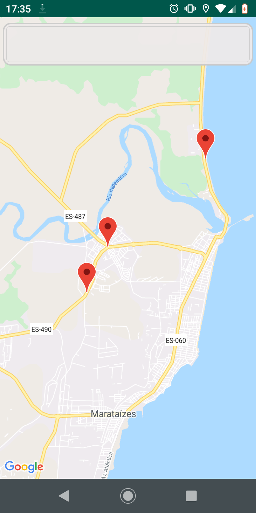
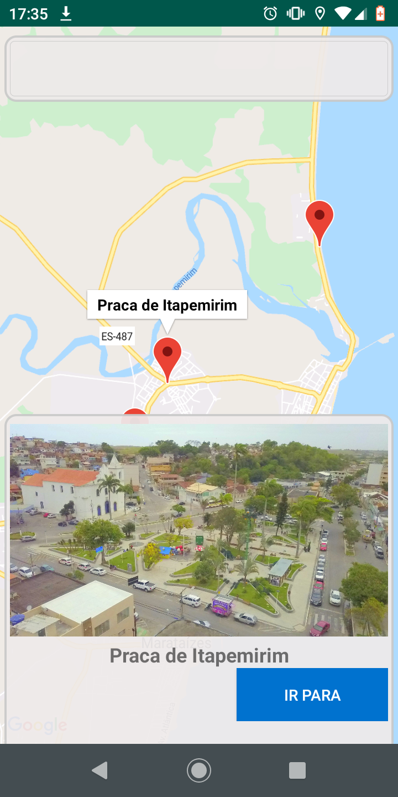
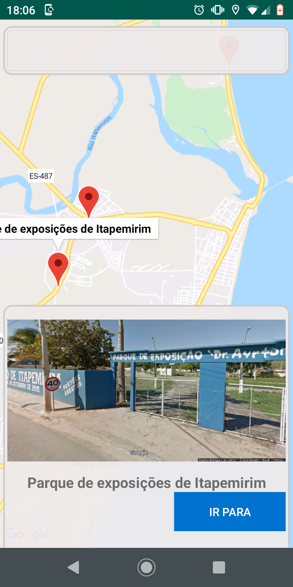
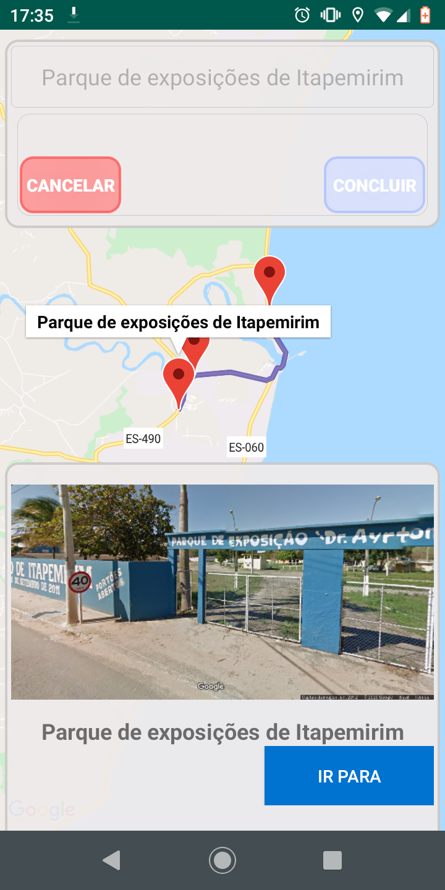
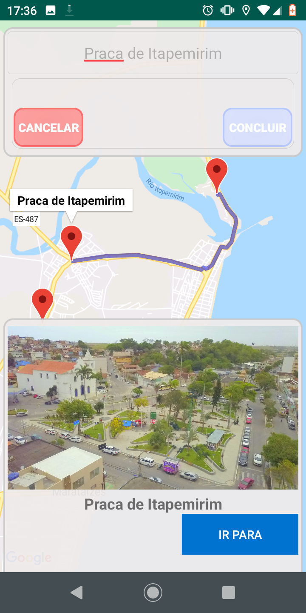
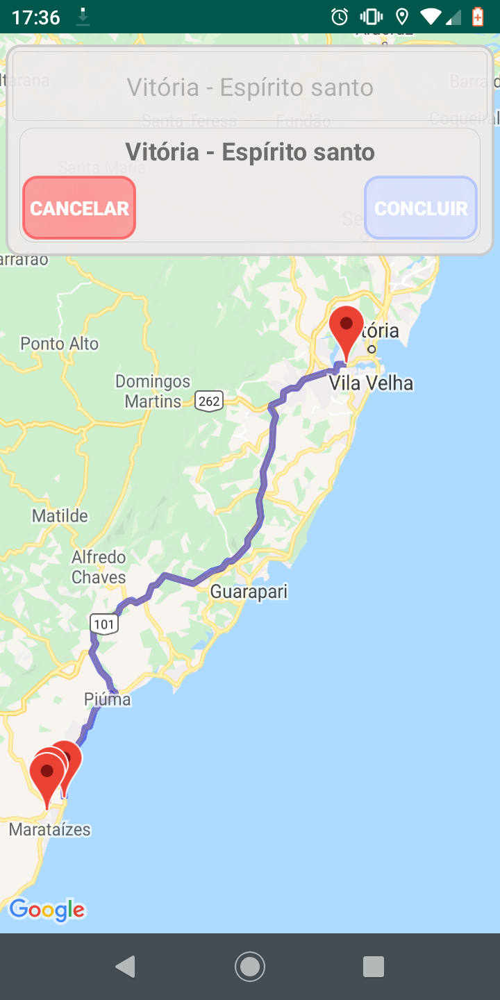

# Itapemirim

### Descrição ###
Aplicativo da Prefeitura de Itapemirim feito como Android Studio.
O aplicativo utiliza a API do Google Maps para criar rotas e obter endereços entre outras features. O objetivo do aplicativo é aplicar as principais ferramentas da API do Google Maps em um projeto real, da maneira mais simples possível.

### Telas do aplicativo ###

Tela inicial                                                  | Destino fixo 1            |  Destino fixo 2
:------------------------------------------------------------:|:-------------------------:|:-------------------------:
      |   | 

Rota fixa 1                                                   | Rota fixa 2 1             |  Rota feita pelo usuário
:------------------------------------------------------------:|:-------------------------:|:-------------------------:
   |   | 
